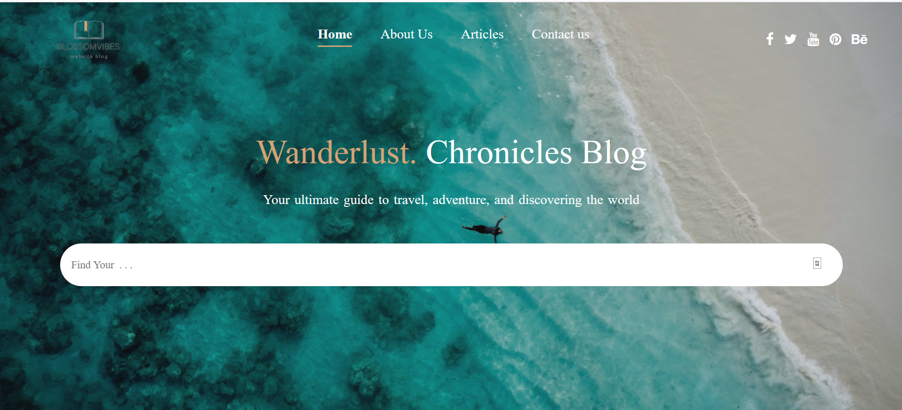
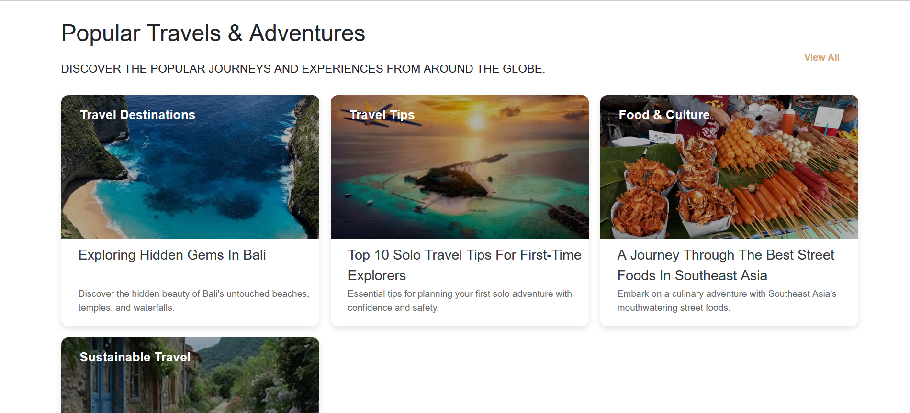
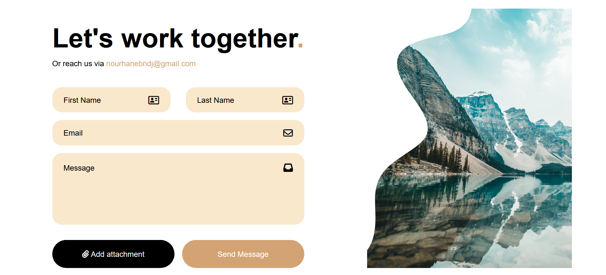
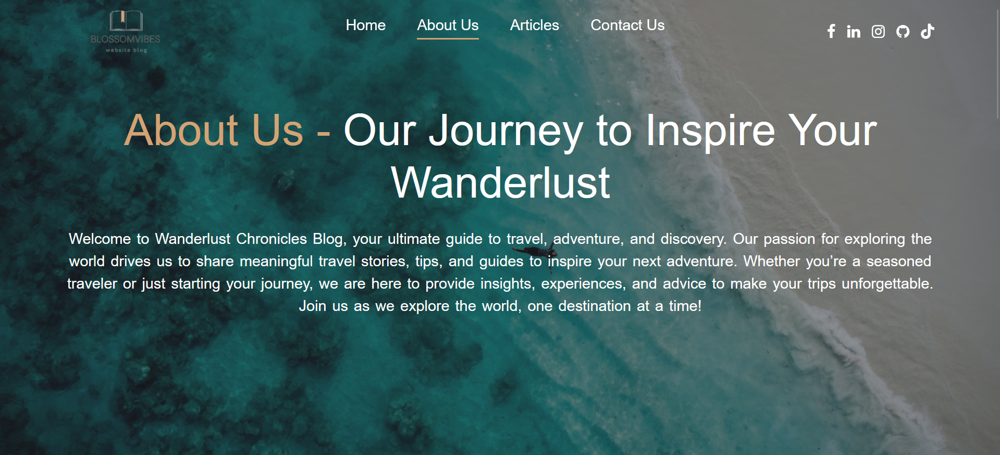
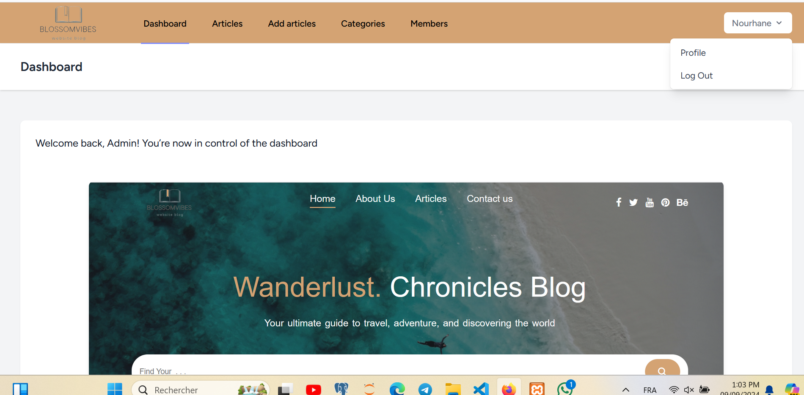
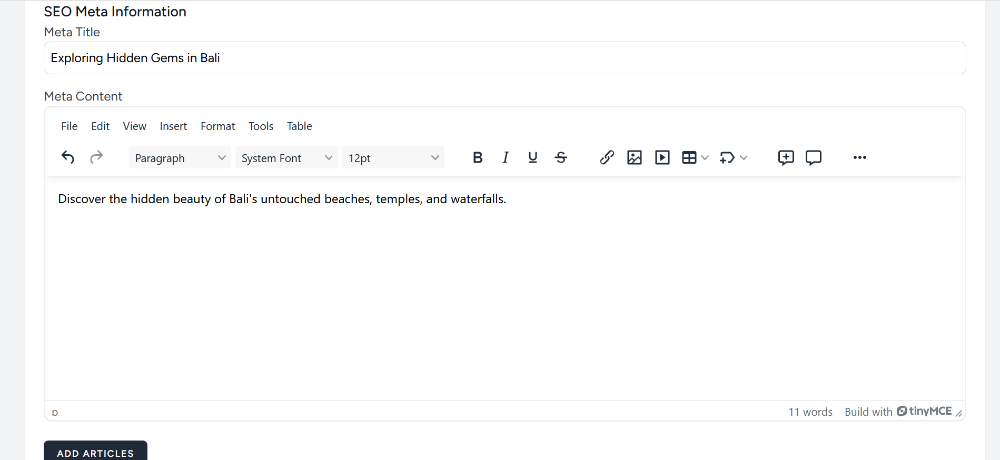
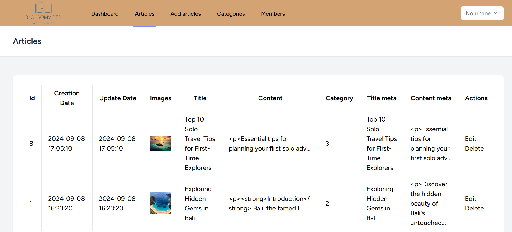

# 🌍 Wanderlust Chronicles

Wanderlust Chronicles is a blogging website designed to share articles about travel, adventure, and cultural discoveries. It offers users the chance to explore insightful articles on various travel destinations, and allows them to read and share posts across social platforms.

## ✨ Features

- 🖥️ **Responsive design**: The website adapts to different screen sizes, providing a seamless experience across devices.
- 📝 **Dynamic Articles**: Each article includes metadata (title, description, image) to enhance SEO and user engagement.
- 📈 **SEO Optimized**: Meta tags are dynamically generated for better visibility on search engines like Google.
- 📲 **Social Sharing**: Users can share articles via Facebook, Twitter, LinkedIn, and WhatsApp.
- 🔗 **User-friendly navigation**: Clean navigation bar with easy access to Home, About Us, Articles, and Contact Us pages.
- 🗺️ **Google Maps Integration**: Displays the company's headquarters location.
- 🌐 **Social Media Links**: Icons linked to social media profiles (Facebook, LinkedIn, GitHub, WhatsApp).

## 🔐 Admin Dashboard

- 🧑‍💼 **Admin Management**: Add, modify, or delete other admin accounts.
- 🗃️ **Category Management**: Admins can create, update, and delete categories for articles.
- ✏️ **Article Management**: Admins can add, edit, or delete articles, complete with metadata (title, description, image, and content).
- 🗑️ **Content Moderation**: Control over content to ensure the quality and relevance of the posts.

## 🛠️ Technologies Used

- **Frontend**: HTML, CSS, Bootstrap, Font Awesome
- **Backend**: Laravel (PHP Framework)
- **Database**: MySQL
- **Libraries**: Font Awesome for icons, Bootstrap for responsive design
- **Version Control**: Git

## 📷 Screenshots

  
  
  
  
  
  
  

## 🗂️ Project Structure

- **Views**: Located in `resources/views`
- **Assets**: Custom styles and scripts located in `public/mainassets/`
- **Routes**: Web routes are defined in `routes/web.php`
- **Controllers**: Article and admin logic are handled in `app/Http/Controllers/ArticleController.php` and `AdminController.php`.

## 🚀 Live Demo

Check out the live version [here](https://yourwebsiteurl.com).

## 📧 Contact

- **Email**: [nourhanebndj@gmail.com](mailto:nourhanebndj@gmail.com)
- **LinkedIn**: [Nourhane Bendjeddou](https://www.linkedin.com/in/nourhane-bendjeddou-a4252625b/)
- **WhatsApp**: [+213658934340](https://wa.me/213658934340)

---

🌟 Feel free to star this project if you find it useful!
